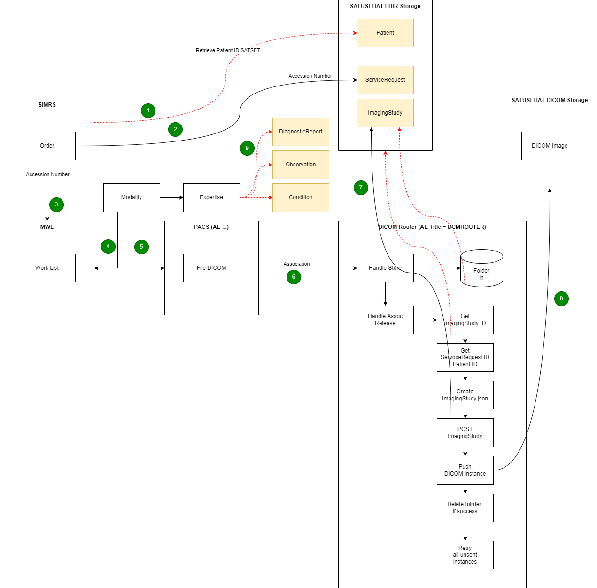

# DICOM Router


Welcome to the DICOM Router repository created by the Digital Transformation Office of the Ministry of Health Indonesia. This software solution provides a reliable and efficient way to send medical images and data through the Digital Imaging and Communications in Medicine (DICOM) standard to SATUSEHAT Platform. The DICOM Router allows for seamless transmission of DICOM images between different healthcare institutions, reducing the risk of data loss and ensuring patient information is securely shared using SATUSEHAT OAuth2 authentication service.

## Architecture Overview


## Get Started
### Tested on : 
- Unix based operating System (Ubuntu server) --> use conda-unix.yml
- MacOS (arm64, Intel) --> use conda-macos-m1.yml / conda-macos-x64.yml
- Windows (Intel) --> use conda-win.yml

### Pre-requisite : 
1. Installed latest Anaconda version (Download [here](https://anaconda.com/products/distribution))
2. Ensure that the port 11112 is opened (default DICOM port)
3. Windows : enable LongPath ```HKEY_LOCAL_MACHINE\SYSTEM\CurrentControlSet\Control\FileSystem```
--> ```LongPathsEnabled``` --> ```Value data``` = ```1``` 

### Setup :
1. Copy ```router.conf.template``` to ```router.conf```
2. Setup your target endpoint in ```router.conf``` in ```url```. Default in template file is dev environment : ```api-satusehat-dev.dto.kemkes.go.id```
3. Insert your SATUSEHAT Organization ID, Client Key, and Secret Key on ```router.conf```. <br> If you don't have access, please access [SATUSEHAT Developer Portal](https://satusehat.kemkes.go.id/sign-up)
4. Run conda env creation in terminal based on .yml environment file provided
#### Environment :
| Environment    | URL |
| ----------- | ----------- |
| Development      | ```api-satusehat-dev.dto.kemkes.go.id```       |
| Staging   | ```api-satusehat-stg.dto.kemkes.go.id```       |
| Production  | ```api-satusehat.kemkes.go.id```       |

#### Conda Installation Script : 
| Server OS    | Conda Script Used |
| ----------- | ----------- |
| Unix      | ```conda env create -n dicom-router -f conda_env/conda-unix.yml```       |
| Windows   | ```conda env create -n dicom-router -f conda_env/conda-win.yml```       |
| MacOS M1  | ```conda env create -n dicom-router -f conda_env/conda-macos-m1.yml```       |
| MacOS Intel  | ```conda env create -n dicom-router -f conda_env/conda-macos-x64.yml```       |


### How to run :
1. Activate conda environment : ```conda activate dicom-router```
2. Move to directory containing main.py : ```cd dicom-router```
3. Run main microservices : ```python main.py -v```

### Testing using DICOM Toolkit :
#### Prerequisite : 
1. Download dcmtk from official site ```https://dicom.offis.de/dcmtk.php.en```
2. Note for Zip Executable Installation : Add ```storescu``` executable to your PATH environment variable
3. POST ```Encounter``` and ```ServiceRequest``` data to SATUSEHAT using Postman or EMR.
4. Send file using the ```storescu``` command

| File format    | Single | Recursive |
| ----------- | ----------- | ----------- |
| .dcm      | ```storescu --call DCMROUTER localhost 11112 file.dcm``` | ```storescu --call DCMROUTER localhost 11112 --scan-directories --recurse STUDY_MR```      |
| JPEG lossless format   | ```storescu --call DCMROUTER -xs localhost 11112 file.dcm```       | ```storescu --call DCMROUTER -xs localhost 11112 --scan-directories --recurse STUDY_MR``` |
| JPEG 2000 lossless format  | ```storescu --call DCMROUTER -xv localhost 11112 file.dcm```       | ```storescu --call DCMROUTER -xv localhost 11112 --scan-directories --recurse STUDY_MR``` |

### Changelog :
See [CHANGELOG](CHANGELOG)

### License :
See [LICENSE](LICENSE)
